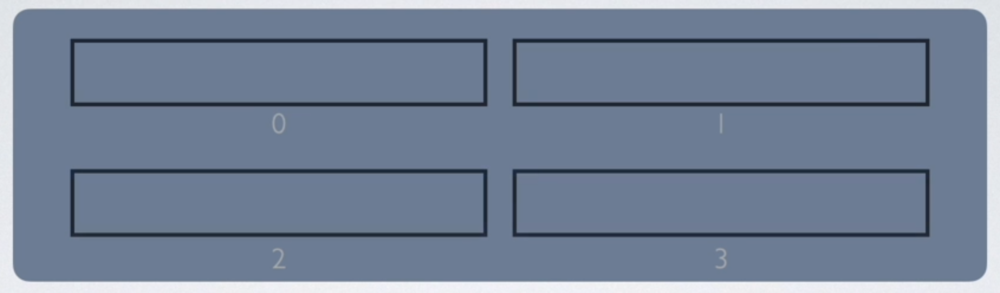
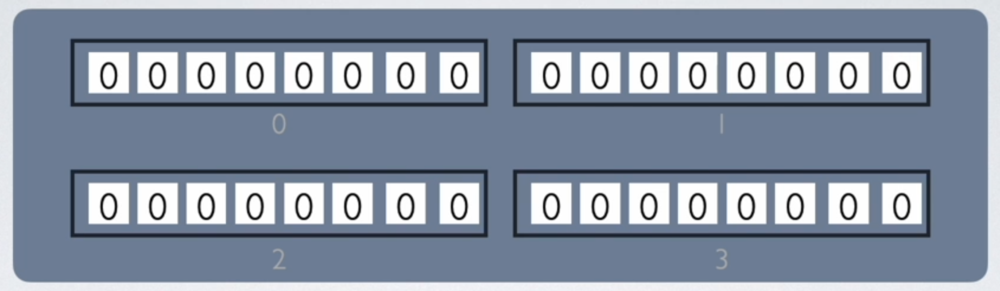
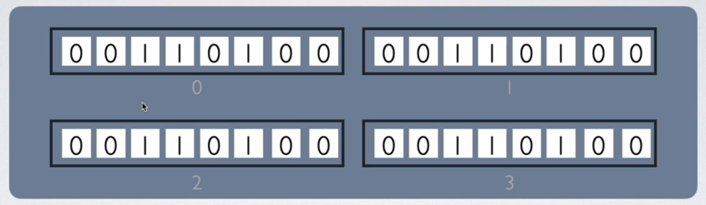

# The Concept of Buffers.

A buffer is a reserved segment of memory (RAM) that is used to hold the data being processed. We need to specify something very specific in bytes to reserve this segment of memory.

Buffers are not arrays, but they work like arrays and they have elements just like an array. Suppose we create a buffer of four bytes. That buffer itself can have four elements, each of them one byte in size and labelled per the index.

    

This four bytes of memory is a very small portion of our memory, but the operating system reserves this memory and allows us to use it for anything that we want. In Node JS, each element within the buffer can hold exactly eight bits of data and we cannot change the size. Another important thing to note here is that as soon as we create this buffer, all the elements within the buffer will be populated by zeros and we can later update this to hold the values that we want.

    

We mentioned earlier that buffers work like arrays. Therefore, we can reference the buffer object and access one its elements with the help of its index. Also, we can modify each element by assigning it a new value. That said, once we create a buffer of a specific size, we cannot modify its size - it we create it at four bytes, it remains at four bytes throughout its existence.

This discussion leads us to the following deduction: buffers are data structures, and they are a data structure specifically designed to work with binary data. Provided we create buffers in the computer memory, we have the ability to quickly move data into the buffer and then quickly pull data out of the buffer when needed. In other words, we can read data from a file, a network request, or another process, and move into the buffer. Then, using the buffer object and its helper methods, we can perform some operations on the data within our buffer if needed. Upon completing the required operations, we can pull that data out of the buffer and send it along to another place.

    

Buffers are extremely efficient regardless of their size, and the step where we must perform some operations on data within our buffer is not mandatory. Therefore, we can simply use the buffer to move some data from one place to another at a great speed. For example, we can use the buffer to move data from a network request to a file, or from another process to the network request.

Another important thing to note is that the size of the buffer is limited by the hardware resources of a machine. In other words, we cannot create a buffer of sixteen gigabytes in a laptop with eight gigabytes of memory.
