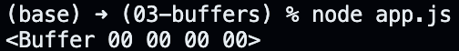
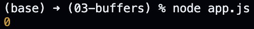
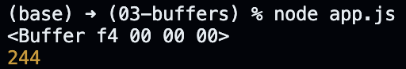
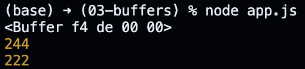
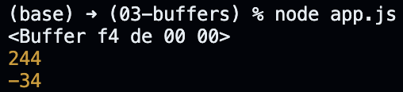
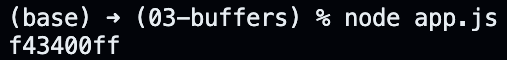
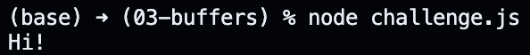

# Buffers in Action.

Now that we understand the concept of buffers, we should work with the buffer object to write some zeros and ones to the memory.

To get started, we should create a file called "app.js" and type in the following code.

```javascript
const { Buffer } = require("buffer");

// Reserving four bytes of memory.
// Each element within the buffer is prefilled by "00000000".
const memoryContainer = Buffer.alloc(4);

console.log(memoryContainer);
```

When we execute the code above, we get the following logged to the console. Note that the values are displayed in hexadecimal, therefore each element holds exactly eight bits like we discussed earlier.

<p align="center">
    
</p>

We can replace the console statement to display the first element within the buffer.

```javascript
const { Buffer } = require("buffer");

const memoryContainer = Buffer.alloc(4);

console.log(memoryContainer[0]);
```

The code above logs the following to the console.

<p align="center">
    
</p>

Now that we have our memory container, we can go ahead and write data on it.

```javascript
const { Buffer } = require("buffer");

const memoryContainer = Buffer.alloc(4);

memoryContainer[0] = 0xf4;

console.log(memoryContainer);
console.log(memoryContainer[0]);
```

The code above logs the following to the console. Note the difference between the two outputs - one represents the first element in hexadecimal, whereas the other represents the first element in decimal number system.

<p align="center">
    
</p>

Provided each element within the buffer can hold one byte, the minimum and the maximum values we can store within an element are 0 and 255, respectively. We can also store negative values to the buffer, but the conversion of negative numbers to binary is not in the curriculum of this course; to understand these things better, study computer organization and computer architecture.

```javascript
const { Buffer } = require("buffer");

const memoryContainer = Buffer.alloc(4);

memoryContainer[0] = 0xf4;
memoryContainer[1] = -34;

console.log(memoryContainer);
console.log(memoryContainer[0]);
console.log(memoryContainer[1]);
```

The code above logs the following to the console.

<p align="center">
    
</p>

Using the bracket notation does the trick of storing the correct negative number within the buffer, but it does not convert back the stored number to a developer friendly output. To manually convert it back, we need to take the stored value (1101 1110), convert the 0s into 1s and vice versa (0010 0001), convert the number to decimal, and finally add one to the result.

```
0xDE
= 1101 1110 (convert to binary)
= 0010 0001 (take compliment)
= 33 + 1    (add one to decimal equivalent)
= 34        (unsigned output)
```

Instead of working through this manually, we can use the built-in methods on the buffer object, and take advantage of the extra functionality they bring to the table.

```javascript
const { Buffer } = require("buffer");

const memoryContainer = Buffer.alloc(4);

memoryContainer.writeUint8(0xf4, 0);
memoryContainer.writeInt8(-34, 1);

console.log(memoryContainer);
console.log(memoryContainer.readUInt8(0));
console.log(memoryContainer.readInt8(1));
```

The code above logs the following to the console.

<p align="center">
    
</p>

There is a whole list of methods to deal with numbers of different sizes. For example, the `writeBigInt64BE` and the `writeBigInt64LE` methods help us work with integers of 64 bits in size. These integers are stored in contiguous elements, but when we access them using the `readBigInt64BE` or the `readBigInt64LE` methods, we get a developer friendly response for the number.

To maintain simplicity throughout the rest of the lecture, we revert back to the code using the bracket notation with positive numbers.

```javascript
const { Buffer } = require("buffer");

const memoryContainer = Buffer.alloc(4);

memoryContainer[0] = 0xf4;
memoryContainer[1] = 0x34;
memoryContainer[2] = 0x00;
memoryContainer[3] = 0xff;

console.log(memoryContainer);
```

The buffer object exposes a few other useful methods. One of them is the `toString` method, which can be used to convert the contents of a buffer into a string. This `toString` method takes in the character encoding to use when decoding the elements of a buffer.

```javascript
const { Buffer } = require("buffer");

const memoryContainer = Buffer.alloc(4);

memoryContainer[0] = 0xf4;
memoryContainer[1] = 0x34;
memoryContainer[2] = 0x00;
memoryContainer[3] = 0xff;

console.log(memoryContainer.toString("hex"));
```

The code above logs the following to the console.

<p align="center">
    
</p>

Note that we can also loop over the buffer object and access/modify the elements of the buffer from within the loop. This is extremely useful when we need to work with buffers in the real world because they can be something like 16,000 bytes in size for a machine with 16 gigabytes of free memory.

If we have some binary data that we must store to our buffer, the ideal procedure is to convert that data into hexademical before storing it - we did it here using the programming calculator.

```javascript
const { Buffer } = require("buffer");

// Need to store: 0100 1000 0110 1001 0010 0001.
const buff = Buffer.alloc(3);

buff[0] = 0x48;
buff[1] = 0x69;
buff[2] = 0x21;

console.log(buff.toString("utf-8"));
```

The code above logs the following to the console.

<p align="center">
    
</p>

This example shows how we can work with some raw binary data and load it up within our memory to perform some operations on it. We can also store this data into a file, send it over a network, or pass it onto another process once it is loaded up in the memory. This also helps us understand that we use a character encoding to make sense of the stored binary data - we converted the binary data to `hex` and `utf-8` when converting it to a string, and the latter encoding gives us English characters.

If we read the documentation, we can find other ways to store data inside the buffer. We can recreate the above example with the following code too.

```javascript
const { Buffer } = require("buffer");

const buff = Buffer.from([0x48, 0x69, 0x21]);

console.log(buff.toString("utf-8"));
```

The following code snippet shows another way to recreate the same example.

```javascript
const { Buffer } = require("buffer");

const buff = Buffer.from("486921", "hex");

console.log(buff.toString("utf-8"));
```

We can also populate the buffer with the help of a string instead of using binary or hexadecimal numbers. The following code snippet recreates the example using the string itself.

```javascript
const { Buffer } = require("buffer");

const buff = Buffer.from("Hi!", "utf-8");

// Logging the buffer itself instead of the UTF-8 string.
console.log(buff);
```

Before we move ahead, there is one final thing we need to understand, which is the representation of unicode characters. If we search up the unicode standard code point for lowercase character "s", we might come across "U+0073". This is simply a notation, and the number "73" is the hexadecimal value of the binary number behind the lowercase character "s" in unicode. Therefore, if w e convert this "73" to a decimal number, we get our good old "115".

Also, URLs only understand the ASCII characters. Therefore, if we send a character that is not ASCII, the character is converted to its hexadecimal value automatically and the binary number is sent over the network. We can confirm this by searching up some non-ASCII character on Google and viewing the URL within the network tab of our developer tools. This information is relevant when we need to send data between the client and the server; we can send the non-ASCII character as binary within the URL, and then apply the relevant character encoding on the server.
