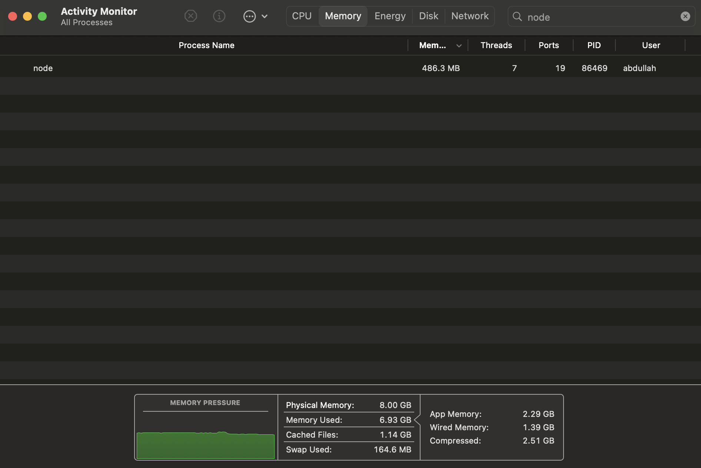

# Allocating Huge Buffers.

We can allocate a significant amount of memory to our buffer and then visualize this allocation within the activity monitor.

Suppose we want to assign 500 megabytes of memory to our buffer and then store a random value `0x22` to each element inside the buffer. We can use the following code to achieve this. We use the `setInterval` here so that our process continues to run instead of quitting instantly.

```javascript
const { Buffer } = require("buffer");

const buff = Buffer.alloc(5e8); // 500,000,000 bytes (500 MB)

setInterval(() => {
  buff.fill(0x22);
}, 5000);
```

Now, if open up our activity monitor and check the memory consumption for the "node" process, we should see the following. Note that most monitors represent the memory consumption in MiB instead of MB. Therefore, the number on the monitor is slightly smaller than the allocated memory at a glance, but behind the scenes, it is the same number.

<p align="center">
    
</p>

By default, we can allocate a maximum of 4 gigabytes of memory to the buffer. We can use the following code to confirm this size. Note that we can also increase the MAX_LENGTH if we must by overriding the default value.

```javascript
const { constants } = require("buffer");

console.log(constants.MAX_LENGTH);
```

Remember that our operating system has a ton of processes that it needs to run behind the scenes. This means that a machine with 8 gigabytes of total memory won't give us 8 gigabytes of free memory for the "node" process. Therefore, if we exceed the total memory of our machine, the whole operating system will crash, not just the "node" process.
