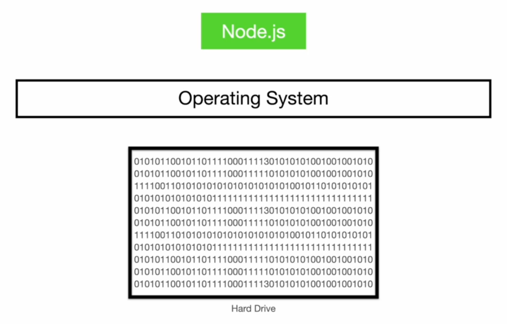
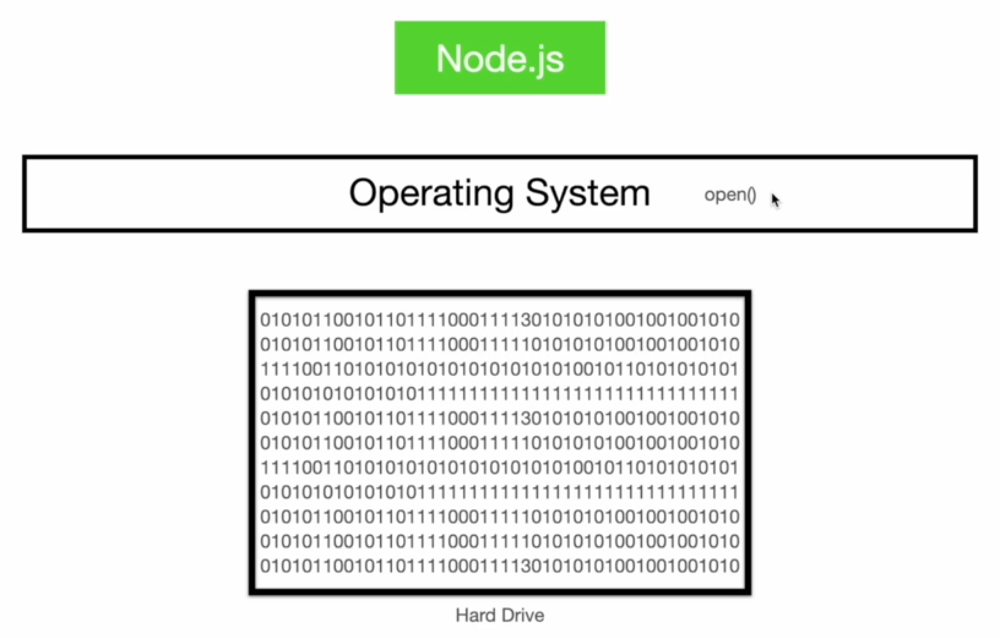

# How Node Deals with Files?

Suppose we have a hard drive and it contains a bunch of files. How does Node JS work with these files stored on the hard drive?

This is where the operating system comes into play again. Before we get into the specifics, the following diagram shows how the operating system lies between the hard drive and the "node" process; when we run a Node application, we open a new process on our operating system.

    

Now, when we deal with files in Node, it has no idea of how to find a file in the hard drive and then modify the bits there. Therefore, it does not go directly to the hard drive. Instead, it talks to the operating system using system calls and the operating system then goes to hard drive to perform different actions.

Suppose we want to open a text file in Node. We will need to inform the operating system about the requirement of opening a file using the system call `open`. Then, the operating system will go to the hard drive, find those zeros and ones, and give us access to that data.

    

Note that we do not directly run the system call. Instead, we run a function inside our code, and then Node JS itself runs the system call using Libuv.

There are other system calls within the operating system to write or rename a file, for example. We do not need to memorize these system calls, but it is always good to know what is happening behind the scenes; Node JS is using Libuv to execute system calls.
