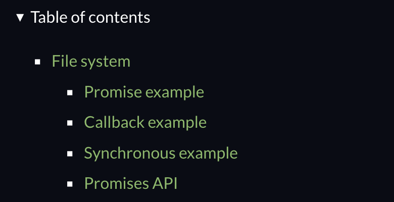

# Ways of Working with FS Module.

There are three different ways to do the exact same thing when working with the FS module in Node.

1. Promises API
1. Callback API
1. Synchronous API

They do not differ in their functionality, but in the way they achieve the results. When starting out, prefer the Promises API for most tasks and avoid the Synchronous API unless absolutely necessary - e.g. loading config before starting the application. The latter blocks the main thread and freezes complete application until the task finishes. Finally, use the Callback API when working with something that requires a ton of computational power because the Callback API is faster than the Promises API per the Node JS documentation.

The following example contains code to create a copy of a file using the three different ways we discussed above. Note that we must comment out two of them and execute one at a time to avoid errors. Also, we must have a file called "file.txt" at the same level as the javascript file.

```javascript
// ****** Promises API *******
const fs = require("fs/promises");

(async () => {
  try {
    await fs.copyFile("file.txt", "copied-promise.txt");
  } catch (error) {
    console.log(error);
  }
})();

// ****** Callback API *******
const fs = require("fs");

fs.copyFile("file.txt", "copied-callback.txt", (error) => {
  if (error) console.log(error);
});

// ****** Synchronous API *******
const fs = require("fs");

fs.copyFileSync("file.txt", "copied-sync.txt");
```

To test out what happens upon encountering an error, change the name of the source file to `key.txt` from `file.txt` and then execute each way of copying the file again. The error code in all three cases would be the same, but the log for the third one would just be a little different to the other two because we do not catch the error.

The Node JS official documentation lists examples for each of the three types of APIs, so the documentation for the file system module is extremely long and comprehensive.

<p align="center">
    
</p>
