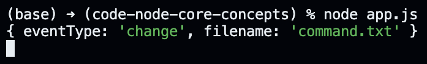
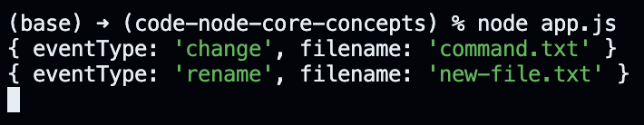

# Watching the Command File for Changes.

In this lecture, we start building our application. To kick things off, we create two files inside a new folder: `app.js` and `command.txt`.

We want our `app.js` file to execute some code when we make a change to anything within the root folder. The following code helps us achieve the desired behavior.

```javascript
const fs = require("fs/promises");

(async () => {
  const watcher = fs.watch("./");

  // "watcher" is an async iterator
  for await (const event of watcher) {
    console.log(event);
  }
})();
```

> Async generators and iterators were added to Javascript recently and they are used when we want to read data coming into the application asynchronously. We can update our code to use the callback syntax instead to simplify the example, but we won't do it here.

Now, if we execute the `app.js` file and then make some changes to the `command.txt` file, we get an object containing event details logged to the console. Remember that we need to save the file to write changes from our memory to the hard-drive, and the file itself only gets changed when we write changes to the hard-drive.

<p align="center">
    
</p>

Since we decided to watch the complete directory for changes, creating a new file within the directory logs the following to the console.

<p align="center">
    
</p>

Note that the eventType property says "rename" instead of "create". Therefore, if we want to distinguish between an actual "rename" and a "create" operation, we'd need to use some other methods exposed by the file system module.

The Node JS documentation informs us that the behavior of `fs.watch` is not consistent across platforms. Therefore, we might come across multiple events being fired for an operation depending on how the operating system and the code editor handles "save" operation. That said, these multiple events won't cause any problems when building our application because of the way we implement our logic.

We do not need to perform any action if the change is made to a file other than `command.txt`. Therefore, we can update our logic to contain an if-statement.

```javascript
const fs = require("fs/promises");

(async () => {
  const watcher = fs.watch("./command.txt");

  // "watcher" is an async iterator
  for await (const event of watcher) {
    if (event.eventType === "change") {
      console.log("The file was changed.");
    }
  }
})();
```
