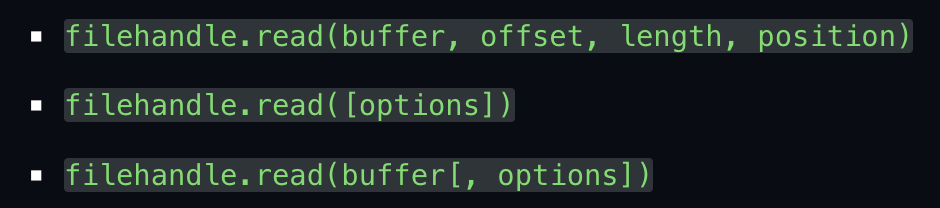
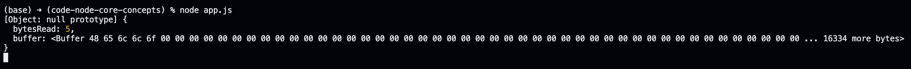
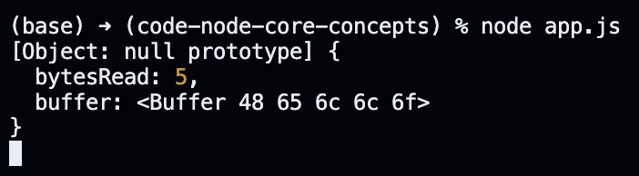
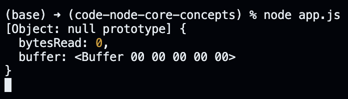

# Reading Content of the Command File.

We can read the content of `command.txt` whenever we make changes to the file. In every programming language and the operating system, we need to work through two steps to achieve this:

- Open the file.
- Read from the file.

When we open a file, we do not move the complete contents of the file to the memory. Instead, we save a file descriptor against that file to the memory; a file descriptor is just a unique number that has been assigned to an open file for identification, nothing else.

The `fs.open` method in the following code snippet creates an instance of the FileHandle class and wraps it around the file descriptor of the provided file.

```javascript
const fs = require("fs/promises");

(async () => {
  // 'r' says we only want to read from the file.
  const commandFileHandler = await fs.open("./command.txt", "r");
  const watcher = fs.watch("./command.txt");

  for await (const event of watcher) {
    if (event.eventType === "change") {
      console.log("The file was changed.");
    }
  }
})();
```

We also need to close the file when we get done performing operations on the file. The opened file is occupying some memory and if we forget to close the file, we can run into the problem of a memory leak. This holds true in other programming languages as well - we allocate a resource, perform the required work, and then free up the resource. We can use the `fs.close` method for closing the file in javascript.

```javascript
const fs = require("fs/promises");

(async () => {
  const commandFileHandler = await fs.open("./command.txt", "r");
  const watcher = fs.watch("./command.txt");

  for await (const event of watcher) {
    if (event.eventType === "change") {
      console.log("The file was changed.");
    }
  }

  commandFileHandler.close();
})();
```

Now, we need to use the `fs.read` method to read the contents of the file we opened. The Node JS documentation lists three overloads of the `fs.read` method. Each of these methods have the same return type, but differ in the way they accept arguments.

<p align="center">
    
</p>

The following code reads the content from the file and logs it to the console.

```javascript
const fs = require("fs/promises");

(async () => {
  const commandFileHandler = await fs.open("./command.txt", "r");
  const watcher = fs.watch("./command.txt");

  for await (const event of watcher) {
    if (event.eventType === "change") {
      const content = await commandFileHandler.read();
      console.log(content);
    }
  }

  commandFileHandler.close();
})();
```

If we start our application and enter the following text within the `command.txt` file.

```
Hello
```

When we save the `command.txt` file, the following object gets logged to the console.

<p align="center">
    
</p>

There are two properties within the object: bytesRead and buffer. The bytesRead property really indicates the number of characters that were read from inside the file. The buffer property builds onto the knowledge of buffers fr om the last section; each element within the buffer represents one unicode character in the hexadecimal form.

The log also shows that we allocate a buffer of more than 16,000 bytes to store 5 bytes. This is not ideal; we do not want to allocate a buffer that is too large and waste resources in the process. To fix this, we can update our code to the following.

```javascript
const fs = require("fs/promises");

(async () => {
  const commandFileHandler = await fs.open("./command.txt", "r");
  const watcher = fs.watch("./command.txt");

  for await (const event of watcher) {
    if (event.eventType === "change") {
      const size = (await commandFileHandler.stat()).size;
      const content = await commandFileHandler.read(Buffer.alloc(size));
      console.log(content);
    }
  }

  commandFileHandler.close();
})();
```

If we start our application and then save the `command.txt` file again, we get the following logged to the console.

<p align="center">
    
</p>

Note that there is also a possibility where the following gets logged to the console instead.

<p align="center">
    
</p>

The reason for such behavior has to do with the position argument of the `fs.read` method. It indicates the location to begin reading data from the file. So, if the value of the argument is something other than zero, the whole file is not read on every read. Instead, Node JS starts off from the location that was not read in the previous read. Therefore, when the location argument is not specified, it appears that Node JS has this anomaly of skipping some bytes and reading data from a different location everytime. Nevertheless, to enforce the behavior of reading from the start of the file, we can make the following changes to the code.

```javascript
const fs = require("fs/promises");

(async () => {
  const commandFileHandler = await fs.open("./command.txt", "r");
  const watcher = fs.watch("./command.txt");

  for await (const event of watcher) {
    if (event.eventType === "change") {
      // get the size of our file and allocate a buffer with the size of our file
      const size = (await commandFileHandler.stat()).size;
      const buffer = Buffer.alloc(size);

      // the location at which we want to start filling our buffer
      const offset = 0;

      // the number of bytes we want to read from the file
      const length = buffer.byteLength;

      // the position we want to start reading the file from
      const position = 0;

      // read the whole content (from the start of the file to the end)
      const content = await commandFileHandler.read(buffer, offset, length, position);
      console.log(content);
    }
  }

  commandFileHandler.close();
})();
```
