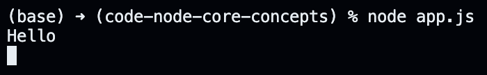

# Making Sense of the Read Data.

We need to run zeros and ones through a decoder now to make sense of the read data. We can use the `toString` method on the buffer object to decode the raw data.

```javascript
const fs = require("fs/promises");

(async () => {
  const commandFileHandler = await fs.open("./command.txt", "r");

  commandFileHandler.on("change", async () => {
    const size = (await commandFileHandler.stat()).size;
    const buffer = Buffer.alloc(size);

    const offset = 0;
    const length = buffer.byteLength;
    const position = 0;

    await commandFileHandler.read(buffer, offset, length, position);
    console.log(buffer.toString("utf-8")); // updated this line
  });

  const watcher = fs.watch("./command.txt");

  for await (const event of watcher) {
    if (event.eventType === "change") {
      commandFileHandler.emit("change");
    }
  }

  commandFileHandler.close();
})();
```

The code above logs the following to the console when we save changes to the `command.txt` file.

<p align="center">
    
</p>

Just to expand on the concept of encoders and decoders, Node JS natively only understands a character encoder and a character decoder; it does not understand image/video encoders or decoders. Therefore, if we want to make sense of a file that is an image by defintion, we cannot do it natively with Node JS. Instead, we need to install third-party packages to decode the file - we can also write the decoder ourself. Upon decoding successfully, we can combine two images, resize an image, crop an image, and do everything else that we want, ofc.
