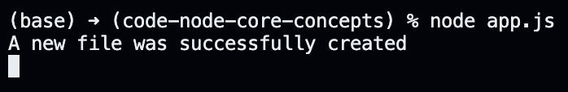
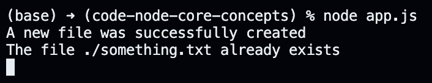

# Implementing the Create File Command.

The idea behind the application in this section is to grab the command from within the `command.txt` file and perform the requested operation inside our Node JS application. In other words, suppose that our `command.txt` file contains the following content.

```
Create a file ./something.txt
```

We want to read this command inside our Node JS application and create a file at the specified path.

```javascript
const fs = require("fs/promises");

(async () => {
  // contants
  const CREATE_FILE = "Create a file";

  // functions
  const createFile = async (path) => {
    try {
      // checking if the file exists
      const existingFileHandler = await fs.open(path, "r");
      console.log(`The file ${path} already exists`);
      existingFileHandler.close();
      return;
    } catch {
      const newFileHandler = await fs.open(path, "w");
      console.log("A new file was successfully created");
      newFileHandler.close();
    }
  };

  // reading from "command.txt"
  const commandFileHandler = await fs.open("./command.txt", "r");

  commandFileHandler.on("change", async () => {
    const size = (await commandFileHandler.stat()).size;
    const buffer = Buffer.alloc(size);

    const offset = 0;
    const length = buffer.byteLength;
    const position = 0;

    await commandFileHandler.read(buffer, offset, length, position);
    const command = buffer.toString("utf-8");

    if (command.includes(CREATE_FILE)) {
      const filePath = command.substring(CREATE_FILE.length + 1);
      createFile(filePath);
    }
  });

  const watcher = fs.watch("./command.txt");

  for await (const event of watcher) {
    if (event.eventType === "change") {
      commandFileHandler.emit("change");
    }
  }

  commandFileHandler.close();
})();
```

If we save the `command.txt` file with the text specified earlier, we should see the following logged to the console.

<p align="center">
    
</p>

We may across instances where we see the following logged to the console upon saving the `command.txt` file. This goes back to our dicussion about the inconsistent behavior of the `fs.watch` method across platforms.

<p align="center">
    
</p>

Note that the logic we implemented earlier also allows us to create a file with an absolute path. Therefore, if we update the text inside `command.txt` to the following and save it, we should have a new file on our desktop.

```
Create a file /Users/abdullah/Desktop/something.txt
```
