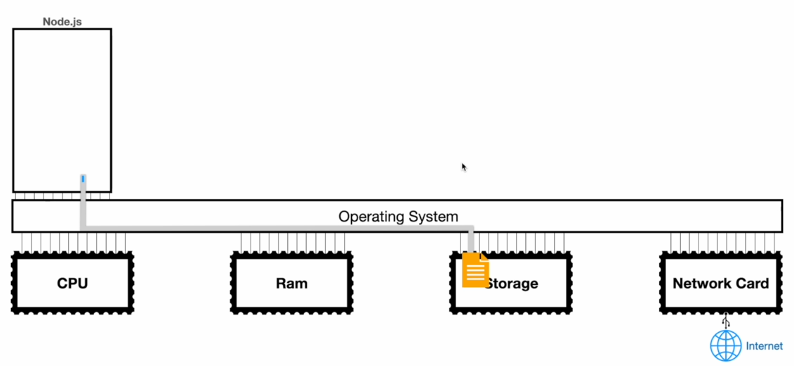
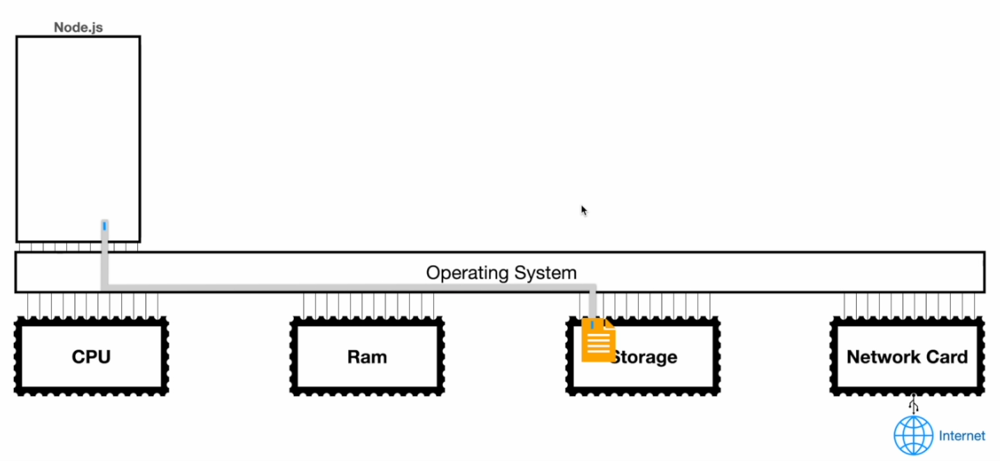
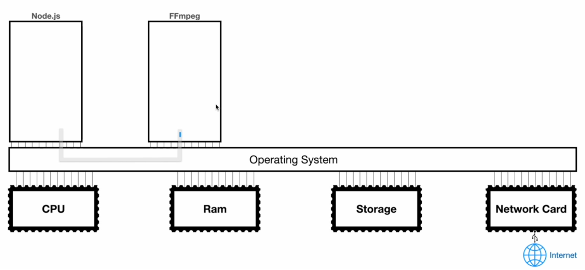
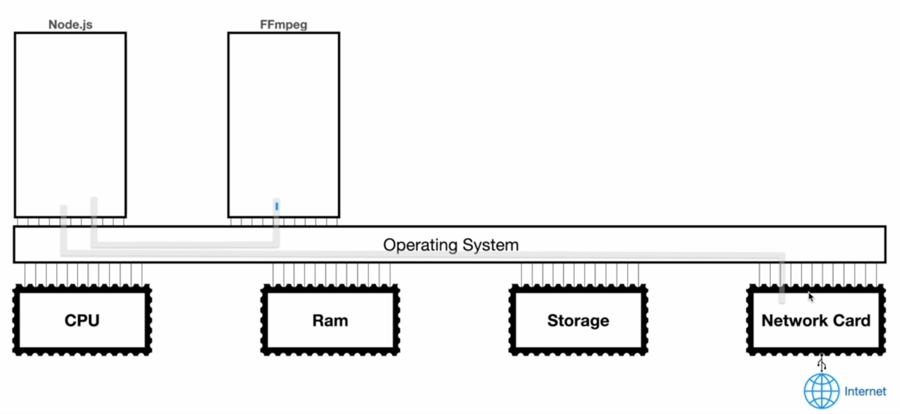

# What are Streams?

The Node JS documentation says that a stream is an abstract interface for working with streaming data in Node. The definition of stream in the English language is just a continuous flow of something. Therefore, if we say that a stream of people is coming to school for the graduation party, we do not mean that five hundred people are coming through the door, one chunk in one second. Instead, we mean that people are coming through the door gradually - five people come in initially, followed by ten people a minute later, followed by another two people a few seconds later, and so on until the total number gets to five hundred. The same concept holds with data streaming in computer science; we do not move everything in one chunk, instead we break things down into multiple chunks, move them over time, and combine them together at the end if needed.

A v good example of data streaming is the copy-paste functionality inside an operating system. Suppose we have a 10GB file on our hard drive and we want to create a copy of that file somewhere - hard drive, remote server, USB etc. Now, to complete this operation, the operating system can load up 10GB of zeros and ones into the memory, and then perform a single write; this is similar to moving five hundred people through the door at the same time. This procedure can be extremely fast, but only if we provide a massive amount of memory to the process - or build a huge door to cater to five hundred people. Therefore, despite the possible speed benefits, this solution is not cost effective.

The ideal solution in such a case would be to setup a stream between the source and the destination. Then, instead of loading up the complete file into the memory, we can load up a small chunk, send it over the stream, and write the chunk to the destination. This forces us to perform more writes, but is much more memory efficient.

Moving back to our example from the last lecture, we wrote to a file one million times before converting our solution to using streams. However, when working with streams, we can use the following diagram to understand what is happening behind the scenes.

    

So, after setting up the stream, we wait at the "node" process for data to gather and get big enough to be equal to the size of our chunk.

    

Then, once it gets big enough, we write that chunk to the file.

    

In Node JS, the default size of a chunk is 16KB. Therefore, we transfer 16KB of data in a single write operation. Also, we wait for the chunk to get big enough inside of a buffer - the "node" process writes data to a buffer and that buffer writes data to our file.

Note that Node JS can also create a stream between two active processes. This helps when we are creating an online video editing application, for example.

    

We can create multiple streams simultaneously from our Node JS application. For example, we create a stream from the "node" process to the network card to deal with requests.

    

Most Node JS application heavily rely on streams and the rest of the course should give us more information about this.
