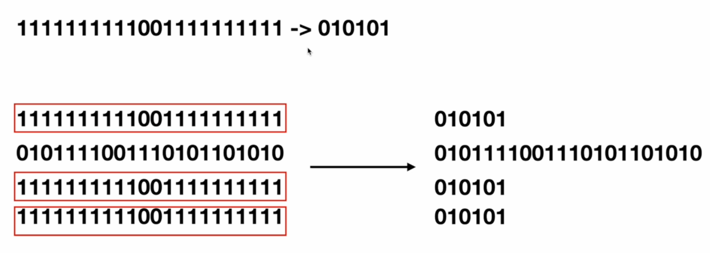
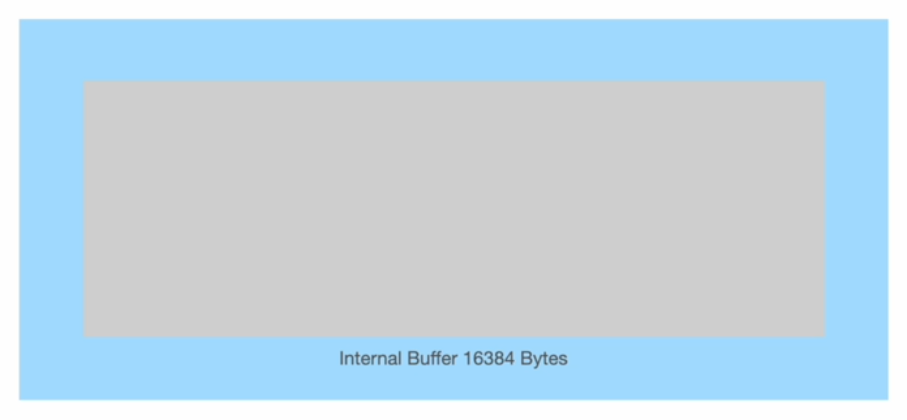
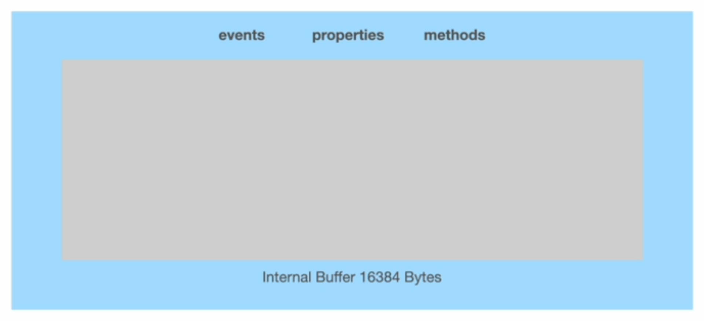
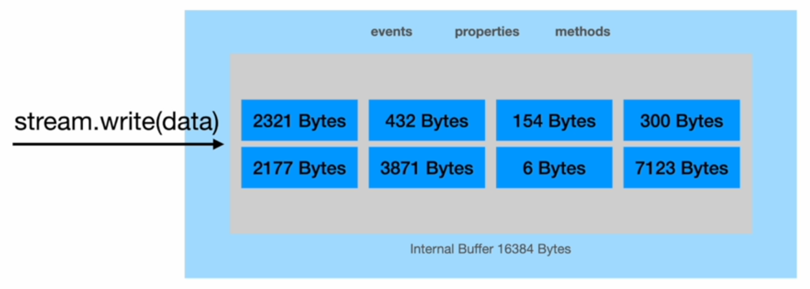
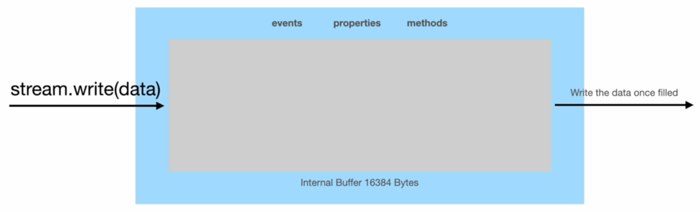
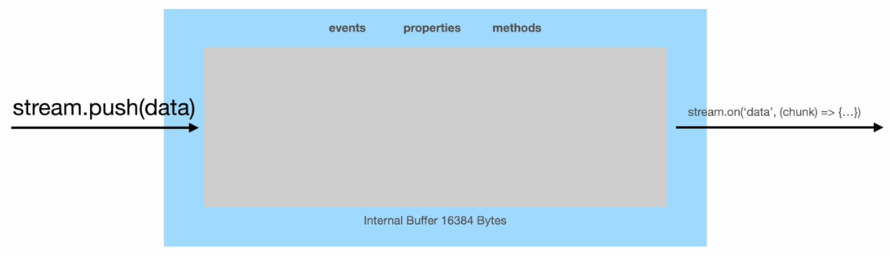

# Types of Streams.

There are a total of four types of streams in Node JS.

<table style="border: 1px solid #BBB; border-collapse: collapse;">
  <tr>
    <th style="border-right: 1px solid #BBB;">Readable Stream</th>
    <td style="border-bottom: 1px solid #BBB;">Streams from which data can be read.</td>
  </tr>
  <tr>
    <th style="border-right: 1px solid #BBB;">Writable Stream</th>
    <td style="border-bottom: 1px solid #BBB;">Streams to which data can be written.</td>
  </tr>
  <tr>
    <th style="border-right: 1px solid #BBB;">Duplex Stream</th>
    <td style="border-bottom: 1px solid #BBB;">Streams that are both Readable and Writable.</td>
  </tr>
  <tr>
    <th style="border-right: 1px solid #BBB;">Transform Stream</th>
    <td style="border-bottom: 1px solid #BBB;">Duplex streams that can modify or transform the data as it is written and read.</td>
  </tr>
</table>
<br />

We saw an example of a writable stream a couple lectures ago when we wrote to a file one million times. To build an example of a readable stream, we can read data from a file some 10GB in size and write that data to another file using a writable stream.

Streams are an incredible option to use whenever we have a flow of data. This flow of data can be between Node and another process or between Node and some underlying hardware resource. And by data, we simply mean zeros and ones.

For example, suppose that we have the following piece of data that we want to encrypt.

```
...001101001...
```

We can create a map inside our application and replace the actual characters with secret codes to encrypt this data. In simpler terms, we can store that `0011` in our data is represented by `111000` outside the application. Therefore, if the data is intercepted by a third-party during the network call, the interceptor gets to see the following encrypted data.

```
...11100001001...
```

If we run this data through a character decoder, we get nothing meaningful. The same happens to the interceptor, unless the person gets access to our secret codes. However, if we want to process this data ourself, we can replace `111000` with `0011` again before performing some computation on this data.

We encrypted a small piece of data in the exercise above. However, suppose we want to encrypt hundreds of megabytes of data. In such a case, moving everything into the memory and then encrypting is not practical. Instead, the ideal option would be to create chunks out of the original data, encrypt each chunk, and write it to a destination. For this, we can use a transform stream.

We can also use a transform stream to compress data. To achieve this, we look for patterns within our data and replace those long patterns with smaller patterns to save some bits at each occurrence. Then, if we want to decompress the compressed data again, we simply plug back the original pattern.

<p align="center">
    
</p>

Note that encryption and compression algorithms work with raw binary data in most cases. Also, in the real world, encryption algorithms are more complex than our example - they use a good amount of prime numbers and discrete math.

---

Now, in the second half of this lecture, we try to understand the internals of a stream object. This will help us understand how streams work under the hood.

Building onto the pattern from earlier, we start off with a discussion about the writable stream object. Suppose that the following rectangle represents a writable stream object, which we can create with something like the `fs.createWriteStream` method.

<p align="center">
    
</p>

Inside this writable stream object, we have an internal buffer of 16,384 bytes in size. These 16,384 bytes represent the default size of the buffer allocated to each stream object in Node, but we can change the default size if needed, ofc.

<p align="center">
    
</p>

Apart from this internal buffer, each writable stream object also has some events, properties, and methods built into it.

<p align="center">
    
</p>

The `stream.write(data)` method is perhaps the most important method on the writable stream object. Whenever we invoke this method, we push some data into the internal buffer of our stream object, and we continue this operation until the buffer is completely filled.

<p align="center">
    
</p>

Once the buffer is completely filled, we write that data to a destination with a single write operation. Therefore, even though we wrote to the stream eight times in our example, we write to the destination one single time, making the complete operation much quicker.

<p align="center">
    
</p>

In the case of writing one million numbers to a file, we initially wrote one million times to the file without the use of streams. However, when we replaced the implementation with that involving a stream, we wrote to the stream one million times, but we only wrote to the file when we had enough data inside the stream. This made our code much quicker.

Now, suppose that we have 2200 bytes of space remaining inside the internal buffer, but we want to push 3000 bytes of data inside the buffer. In such a case, Node JS will push 2200 bytes to the internal buffer, keep track of the remaining 800 bytes inside another buffer in the memory, clear out the internal buffer, and then push the remaining 800 bytes into the internal buffer.

What happens if we continue to push into the internal buffer before it clears out? Well, we run into memory issues. Suppose we want to write 800MB of data to the stream before it gets the chance to write to the destination. This operation will fill up the internal buffer with 16KB of data, and buffer the rest to our memory, consequently consuming close to 800MB of our memory.

Since we want to use streams to speed up the writing to the destination, but we do not want our memory usage to go out of bounds, we need to wait for the internal buffer to empty out before writing to the stream again. This process of emptying out the internal buffer of a stream is called draining and we have an actual Node JS event for us to use.

Next, we take a deeper look at the readable stream object. Again, we have a rectange to represent a readable stream object, which we can create with something like the `fs.createReadStream` method.

<p align="center">
    
</p>

Again, inside this readable stream object, we have an internal buffer of 16,384 bytes in size.

<p align="center">
    
</p>

Apart from this internal buffer, each readable stream object also has some events, properties, and methods built into it.

<p align="center">
    
</p>

To push some data into the readable stream, we use the `stream.push(data)` method.

<p align="center">
    
</p>

Again, we keep pushing into the internal buffer and once it gets filled, we get an event called `data`. We need to listen to this event continuously in order to make use of the chunks available for some operation, such as writing them to another stream.

<p align="center">
    
</p>

Duplex and transform streams are v similar to the two streams we discussed above with one significant difference: they have two internal buffers, one for reading data and the other for writing data.
