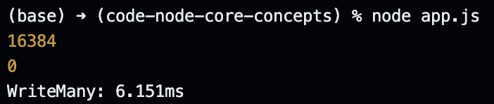
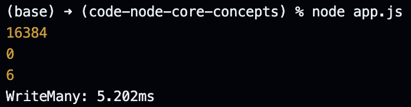

# Fixing the Memory Issue in our Program.

In this lecture, we bring back the program in which we naively implemented streams to write one million numbers to a file.

```javascript
const fs = require("node:fs/promises");

// Execution Time: 170ms.
// CPU Usage: 100% (One Core).
// Memory Usage: 200MB.
(async () => {
  console.time("WriteMany");

  const fileHandle = await fs.open("test.txt", "w");

  const stream = fileHandle.createWriteStream();

  for (let i = 0; i < 1000000; i++) {
    const buff = Buffer.from(` ${i} `, "utf-8");
    stream.write(buff);
  }

  console.timeEnd("WriteMany");
})();
```

Before anything else, we remove the for-loop and log two properties to help us determine the usage statistics for our internal buffer created by the stream object.

```javascript
const fs = require("node:fs/promises");

(async () => {
  console.time("WriteMany");

  const fileHandle = await fs.open("test.txt", "w");

  const stream = fileHandle.createWriteStream();

  // Total internal buffer size.
  console.log(stream.writableHighWaterMark);

  // Filled internal buffer size.
  console.log(stream.writableLength);

  console.timeEnd("WriteMany");
})();
```

Upon executing the code above, we get the following logged to the console. Note that we have not called the `stream.write` method, therefore the internal buffer is empty.

<p align="center">
    
</p>

We can now update our code to write something to buffer and then log the filled internal buffer size again.

```javascript
const fs = require("node:fs/promises");

(async () => {
  console.time("WriteMany");

  const fileHandle = await fs.open("test.txt", "w");

  const stream = fileHandle.createWriteStream();

  console.log(stream.writableHighWaterMark);
  console.log(stream.writableLength);

  // Writing six bytes since each character takes up one byte.
  const buff = Buffer.from("string");
  stream.write(buff);

  console.log(stream.writableLength);
  console.timeEnd("WriteMany");
})();
```

Upon executing the code above, we get the following logged to the console.

<p align="center">
    
</p>

Coming back to our for-loop, we can see that we keep writing to the internal buffer and we keep increasing the `writableLength` value. However, when the `writableLength` value becomes equal to the `writableHighWaterMark` value, the remaining data starts buffering inside the computer memory to get added to the internal buffer once it empties out. This results in high memory consumption until everything is written to the destination or the process reaches an end.

To tackle this, we must check if the internal buffer has some remaining space before writing to the stream. The response of the `stream.write` method provides us this information. If the method returns `true`, we can continue to write to the stream, but if it returns `false`, we must wait for the internal buffer to clear out before writing to the stream.

```javascript
const fs = require("node:fs/promises");

// Execution Time: 200ms.
// CPU Usage: 100% (One Core).
// Memory Usage: 45MB.
(async () => {
  console.time("WriteMany");

  const fileHandle = await fs.open("test.txt", "w");

  const stream = fileHandle.createWriteStream();

  let i = 0;

  const writeMany = () => {
    while (i < 1000000) {
      const buff = Buffer.from(` ${i} `, "utf-8");

      // This is our last write, "stream.end" emits "finish" event.
      if (i === 999999) {
        return stream.end(buff);
      }

      // If stream.write returns false, stop the loop.
      if (!stream.write(buff)) break;

      i++;
    }
  };

  writeMany();

  // Resume our loop once the stream's internal buffer is emptied.
  stream.on("drain", () => {
    writeMany();
  });

  stream.on("finish", () => {
    console.timeEnd("WriteMany");
    fileHandle.close();
  });
})();
```

Now, if we increase the total numbers we want to write from one million to one billion, our memory usage should still not be very significant and the only real impact of this operation should be seen in the execution time.

```javascript
const fs = require("node:fs/promises");

// Execution Time: 200s.
// CPU Usage: 100% (One Core).
// Memory Usage: 50MB.
(async () => {
  console.time("WriteMany");

  const fileHandle = await fs.open("test.txt", "w");

  const stream = fileHandle.createWriteStream();

  let i = 0;

  const writeMany = () => {
    while (i < 1000000000) {
      const buff = Buffer.from(` ${i} `, "utf-8");

      // This is our last write, "stream.end" emits "finish" event.
      if (i === 999999999) {
        return stream.end(buff);
      }

      // If stream.write returns false, stop the loop.
      if (!stream.write(buff)) break;

      i++;
    }
  };

  writeMany();

  // Resume our loop once the stream's internal buffer is emptied.
  stream.on("drain", () => {
    writeMany();
  });

  stream.on("finish", () => {
    console.timeEnd("WriteMany");
    fileHandle.close();
  });
})();
```

We can also check the number of times the write to destination is triggered by keeping track of the "drain" event. For this, we log something everytime the "drain" event is emitted. Then, we copy these logs and paste inside the code editor to count the number of lines; it turns out close to 480.

```javascript
const fs = require("node:fs/promises");

// Execution Time: 200s.
// CPU Usage: 100% (One Core).
// Memory Usage: 50MB.
(async () => {
  console.time("WriteMany");

  const fileHandle = await fs.open("test.txt", "w");

  const stream = fileHandle.createWriteStream();

  let i = 0;

  const writeMany = () => {
    while (i < 1000000) {
      const buff = Buffer.from(` ${i} `, "utf-8");

      if (i === 999999) {
        stream.end(buff);
        return;
      }

      if (!stream.write(buff)) break;

      i++;
    }
  };

  writeMany();

  stream.on("drain", () => {
    console.log("Drained!");
    writeMany();
  });

  stream.on("finish", () => {
    console.timeEnd("WriteMany");
    fileHandle.close();
  });
})();
```

We can make sense of this number by getting the file size of our destination and then dividing that file size by 16,384 bytes.

```
7,892,693 / 16,384 = 481.73175
```

Since we have a remainder in the form of a decimal, we can conclude that we are writing 482 times to the file, but we are draining the internal buffer 481 times - we do not need to drain if the value is smaller than the size of the internal buffer.

This lecture wraps up our deep dive into writable streams. We continue to use them throughout the rest of the course because they are extremely important, but we will not study the concept in isolation again.
