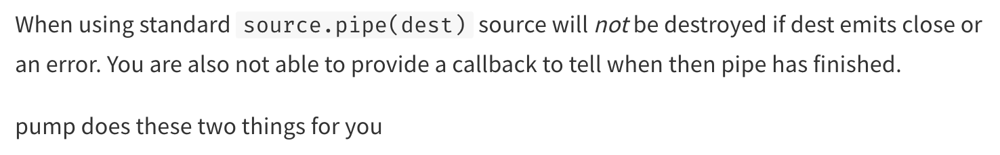

# Piping.

We can now convert our solution to use the built-in Node JS streams. Again, we listen for the data event, get chunks, write them to the destination file, but handle pausing, draining, and resuming ourselves in the process.

```javascript
const fs = require("node:fs/promises");

// File Size Copied: 1GB.
// Memory Usage: 30MB.
// Execution Time: 2s.
(async () => {
  console.time("copy");
  const srcFile = await fs.open("src.txt", "r");
  const destFile = await fs.open("dest.txt", "w");

  const readStream = srcFile.createReadStream();
  const writeStream = destFile.createWriteStream();

  readStream.on("data", (chunk) => {
    // if the write buffer is full, give it time to drain
    if (!writeStream.write(chunk)) {
      readStream.pause();
    }
  });

  writeStream.on("drain", () => {
    readStream.resume();
  });

  console.timeEnd("copy");
})();
```

Node JS has a built-in solution to handle back-pressuring, so we do not have to manage pausing, draining, and resuming ourselves. This solution is called piping.

```javascript
const fs = require("node:fs/promises");

// File Size Copied: 1GB.
// Memory Usage: 30MB.
// Execution Time: 700ms.
(async () => {
  console.time("copy");
  const srcFile = await fs.open("src.txt", "r");
  const destFile = await fs.open("dest.txt", "w");

  const readStream = srcFile.createReadStream();
  const writeStream = destFile.createWriteStream();

  // pipe also accepts duplex and transform streams since they are readable and writable.
  readStream.pipe(writeStream);

  readStream.on("end", () => {
    console.timeEnd("copy");
  });
})();
```

Note that the readable stream does not read from the file until we implement piping or listen for the "data" event. We can confirm this behavior with some console statements.

```javascript
const fs = require("node:fs/promises");

(async () => {
  console.time("copy");
  const srcFile = await fs.open("src.txt", "r");
  const destFile = await fs.open("dest.txt", "w");

  const readStream = srcFile.createReadStream();
  const writeStream = destFile.createWriteStream();

  // logs "null".
  console.log(readStream.readableFlowing);

  readStream.pipe(writeStream);

  // logs "true".
  console.log(readStream.readableFlowing);

  readStream.unpipe(writeStream);

  // logs "false".
  console.log(readStream.readableFlowing);

  readStream.on("end", () => {
    console.timeEnd("copy");
  });
})();
```

The `pipe` method is not great at error handling, but errors are v common in production; suppose we deploy an application to production, but the system loses network connection for half a second or loses a service altogether for a couple seconds. Without error handling, the streams continue to stay open, which can lead to memory leaks and memory issues. To deal with this, we used the `pump` package on npm for Node versions prior to Node 10 - or beyond if we want to stick to `pipe`.

<p align="center">
    
</p>

Beyond Node 10, we can use the `pipeline` method exported by `node:stream` instead.

```javascript
const { pipeline } = require("node:stream");
const fs = require("node:fs/promises");

(async () => {
  console.time("copy");
  const srcFile = await fs.open("src.txt", "r");
  const destFile = await fs.open("dest.txt", "w");

  const readStream = srcFile.createReadStream();
  const writeStream = destFile.createWriteStream();

  pipeline(readStream, writeStream, (err) => {
    if (err) console.error(err);

    console.timeEnd("copy");
  });
})();
```

Note that we can also use the `finish` method exported by `node:stream` for error handling and cleanup - just to iterate, never skip error handling and cleanup for applications in production.
