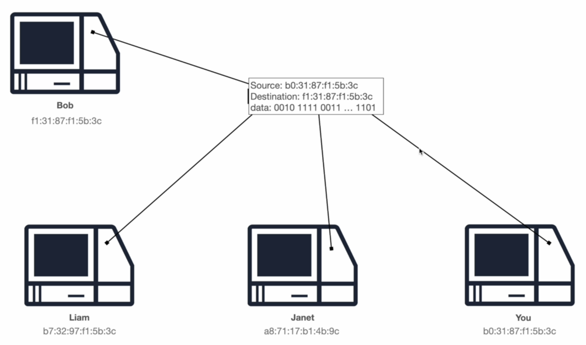

# MAC Addresses and Switches.

Around 30 years ago, if we wanted to share a file between two computers, we had to use some external storage device, such as the Floppy Disk or the Compact Disk (CD). The problem with this approach was that we had to pass on the physical device to the other person - it was inconvenient and inefficient even if both individuals were in the same office space.

    

With the introduction of networking technology, sharing information between computers inside an office building became much easier. Suppose we have the following four computers inside an office space.

    

To share information between these four computers, we can create a network using a common switch and an independent ethernet cable for each computer.

    

To accept an ethernet cable, each computer must have a network card attached to it. The network card also associates a unique MAC address to each computer.

    

The unique MAC address is then used to send data from a source to a destination inside a network.

    

The source specifies the destination MAC address and sends it over to the switch, which is then responsible to route the packet to the destination computer.

    

