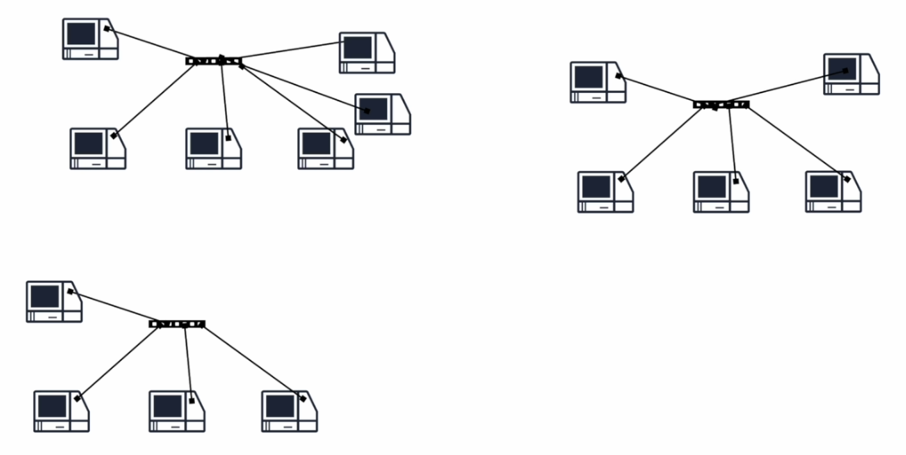
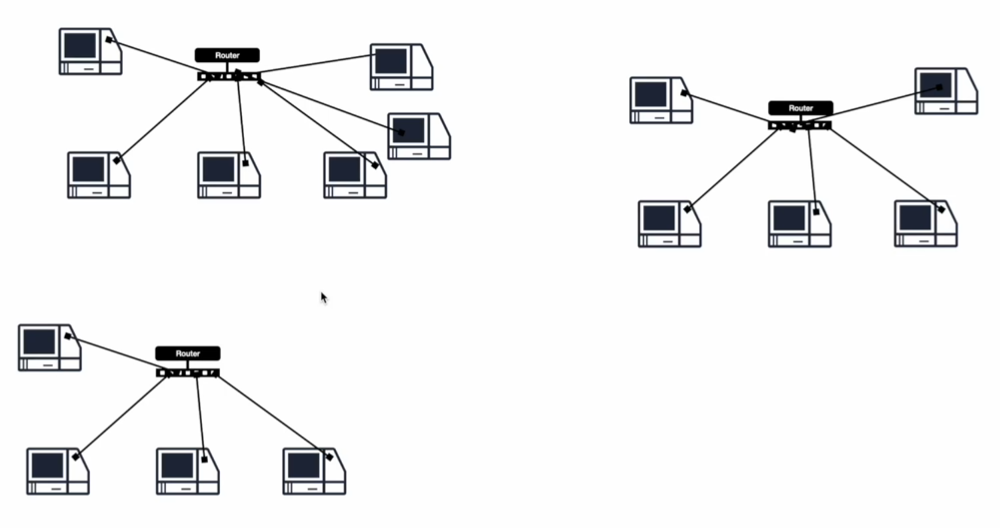
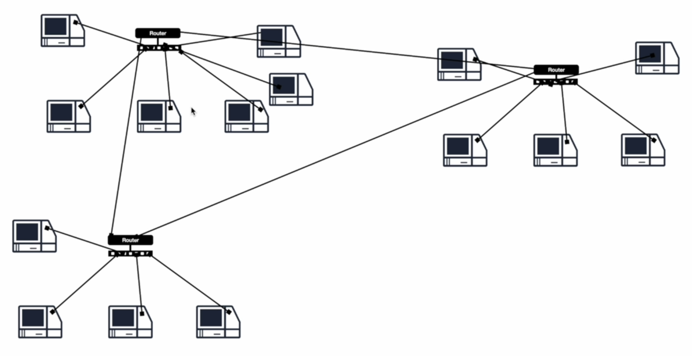
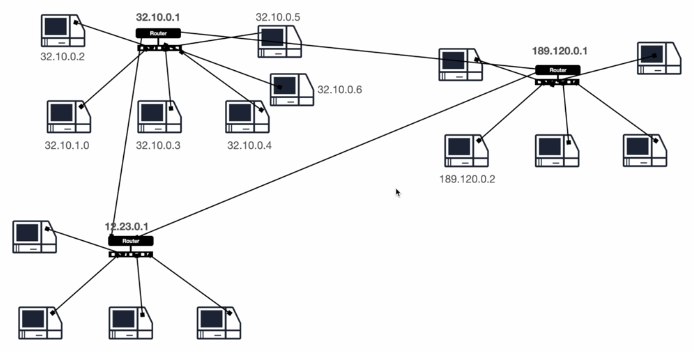
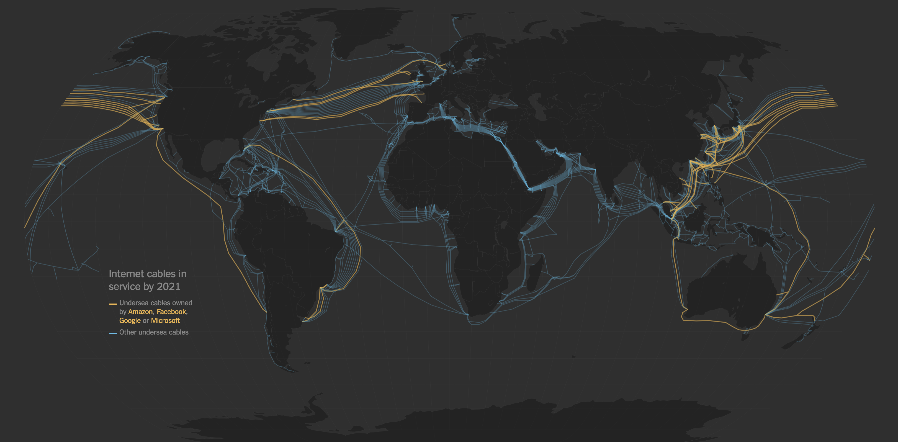

# Routers and the Internet.

What if we want to connect three networks at different geographical locations and get them to talk to each other?

    

To connect these three networks to each other, we must attach a router to the switch in each network.

    

Once we have the routers, we can connect them together using cables.

    

Routers do not work with MAC addresses. Instead, they use unique IP addresses to identify a resource - each router assigns an IP address to every computer connected to it.

    

To communicate, the packet must contain information of the destination IP address - and port - so that the routers can redirect traffic to that resource.

This is how the internet works - it is a network of networks that consists of private, public, academic, business, and government networks of local to global scope, linked by a broad array of electronic, wireless, and optical networking technologies.

    

ISPs provide us with the resources to connect to this huge, vast network. The "router" they provide is usually a switch and a router combined into a single device. One last thing: the cables that make up the Internet simply carry zeros and ones across the world - hard to imagine, but it is what it is.
