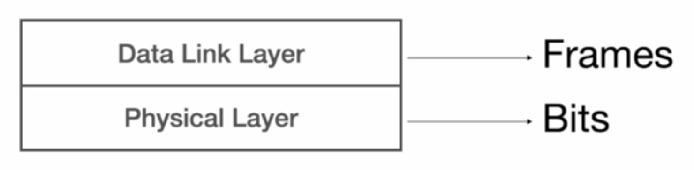

# Networking Layers.

Networking refers to the process of connecting computers and other devices together to enable them to communicate and share resources. It involves establishing physical or virtual connections between these devices, allowing for the exchange of data and information. The Internet is the most prominent example of a network, serving as a vast interconnected system that enables global communication and access to information. The TCP/IP model serves as a foundational framework, defining the protocol layers that govern data transmission and reception in computer networks.

## Physical Layer.

At the base of the TCP/IP model is the Physical Layer, which forms the foundation of network communication. This layer is concerned with the physical connection between devices, managing the transmission and reception of raw binary data (zeros and ones) over a physical medium such as cables, fiber optics, or radio waves. The Physical Layer involves hardware components like cables, connectors, and repeaters. It translates the frames from the Data Link Layer into signals (electrical, optical, or radio) and sends them over the medium. At the receiving end, it converts the signals back into binary data and passes them up to the Data Link Layer. Network Interface Cards (NICs) operate at both the Physical and Data Link Layers, providing the hardware interface to the network medium.

    

## Data Link Layer.

Directly above the Physical Layer is the Data Link Layer, which establishes a direct link between two connected nodes, enabling node-to-node data transfer within the same local network. This layer takes the raw binary data provided by the Physical Layer and packages it into frames. A frame includes a header containing MAC addresses, which uniquely identify the source and destination devices within the same local network. Switches operate at this layer to forward frames based on MAC addresses, facilitating efficient and reliable data transmission between devices on the same network. NICs play a crucial role at this layer by providing the unique MAC address and handling frame creation and transmission. When a frame reaches its destination network, the Data Link Layer examines the MAC address to determine the specific device to which the data should be forwarded, ensuring that data reaches the correct end device. The Data Link Layer is also responsible for error detection and correction, ensuring data integrity as it moves across the network.

    

## Network Layer.

Above the Data Link Layer is the Network Layer, which handles the routing of data across interconnected networks. This layer is crucial for managing the delivery of packets from their source to their destination across multiple networks, a process known as internetworking. The Network Layer assigns logical IP (Internet Protocol) addresses to packets and determines the optimal path for data transmission. With logical addressing provided by IP addresses, devices can be identified and located globally. Routers operate at this layer to forward packets based on their IP addresses, making decisions on the best route for the data to travel across complex and diverse networks.

When a packet is sent, it does not travel directly from the source router to the destination router. Instead, it works its way through multiple routers, each forwarding the packet to the next router closer to the destination. Each router changes the MAC address to reflect the next hop while keeping the IP address consistent. The final router in the path is responsible for delivering the packet to the correct destination computer within the local network. The final router uses the destination IP address to ensure the packet is for a computer in its local network, determines the destination computer's MAC address based on its IP address using ARP (Address Resolution Protocol), and then uses the destination MAC address to deliver the frame directly.

    

## Transport Layer.

On top of the Network Layer is the Transport Layer, which ensures reliable data transfer between end systems. This layer provides end-to-end communication services for applications by managing data transfer to ensure complete and accurate delivery without errors, duplication, or loss. Data at this stage is organized into segments. The Transport Layer uses protocols like TCP (Transmission Control Protocol) and UDP (User Datagram Protocol). TCP is designed for reliability, ensuring that all data is received accurately and in sequence. It does this by establishing a connection between the source and destination computers, checking for errors, and resending any lost data. This is essential for applications where data integrity is crucial, such as web pages and emails. UDP, on the other hand, is faster and works without establishing a connection, making it suitable for applications like video streaming where speed is more important than perfect accuracy. The Transport Layer adds headers to the segments that include information like port numbers, which help identify the specific application or service that the data is intended for on the receiving node.

    

## Application Layer.

At the highest level of the TCP/IP model is the Application Layer, which provides network services directly to user-facing applications. This layer includes various protocols that support essential internet services such as web browsing, email, and file transfer. Key protocols include HTTP (Hypertext Transfer Protocol) for accessing web pages, FTP (File Transfer Protocol) for file transfers, SMTP (Simple Mail Transfer Protocol) for sending emails, and DNS (Domain Name System) for resolving domain names to IP addresses. The Application Layer enables software applications to communicate with the lower layers of the TCP/IP model, facilitating the end-user experience by allowing applications to effectively use the network infrastructure for data exchange. When a user sends a message, requests a web page, or uploads a file, the data generated at the Application Layer is passed down to the Transport Layer for further processing and transmission across the network.

    

---

## Summary of Data Flow in the TCP/IP Model.

### Source Computer.

- Application Layer: Generates data (e.g. a web request) and passes it to the Transport Layer.
- Transport Layer: Breaks data into segments, adds headers, and sends it to the Network Layer.
- Network Layer: Encapsulates segments into packets, adds IP headers, and sends them to the Data Link Layer.
- Data Link Layer: Encapsulates packets into frames, adds MAC headers with the MAC address of the NIC in the source computer and the MAC address of the NIC in the destination router, and sends them to the Physical Layer.
- Physical Layer: Converts frames into signals and transmits them over the medium.

### Intermediate Routers.

- Physical Layer: Receives signals and converts them back into bits.
- Data Link Layer: Converts bits into frames, processes frames, strips MAC headers, and passes frames to the Network Layer.
- Network Layer: Extracts packets from frames, examines IP headers to determine the destination IP address, and uses routing tables to determine the next hop.
- Data Link Layer: Re-encapsulates packets into new frames with updated MAC headers. The new frames use the MAC address of the outgoing interface of the current router as the source and the MAC address of the incoming interface of the next router as the destination. The Data Link Layer then sends these frames to the Physical Layer for transmission to the next router.

### Destination Network Router.

- Physical Layer: Receives signals and converts them back into bits.
- Data Link Layer: Converts bits into frames, processes frames, strips MAC headers, and passes frames to the Network Layer.
- Network Layer: Extracts packets from frames, confirms the packet is for the local network, uses ARP to find the MAC address corresponding to the destination IP address, and passes the packet back to the Data Link Layer.
- Data Link Layer: Encapsulates the packet into a frame with the MAC address of the router interface as the source and the MAC address of the destination computer as the destination. The Data Link Layer then sends the frame to the Physical Layer for final transmission.

### Destination Computer.

- Physical Layer: Receives signals and converts them back into bits.
- Data Link Layer: Converts bits into frames, processes frames, checks the MAC address to ensure it matches the MAC address of the destination computer, and passes frames to the Network Layer.
- Network Layer: Extracts packets from frames, verifies the IP address, strips the IP header, and passes packets to the Transport Layer.
- Transport Layer: Converts packets to segments, checks for errors, and delivers it to the Application Layer.
- Application Layer: Reassembles segments into the original data, processes the data, and delivers it to the user application (e.g. displays the web page).

---

## Recap.

Software Engineers only need to care about the Application Layer. The rest of the four layers are the responsibility of a Network Engineer. When working with Node, we only need to decide on the use of TCP or UDP, the rest is taken care of automatically behind the scenes and we do not need to care about how data is sent across the network.

    

Now, the Application Layer itself is a v complex layer. We can create SSH applications, FTP applications, SMTP applications, and a ton more using Node JS, not just HTTP applications. This is because all these protocols are built on top of TCP - and there a few others built on top of UDP. Therefore, getting extremely good at working with the Application Layer is super important to become a great Software Engineer.
