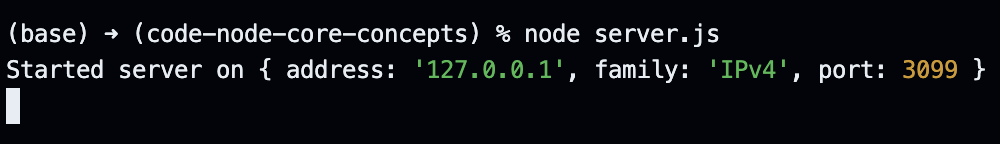
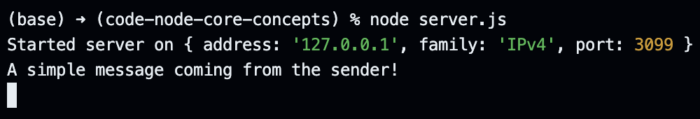
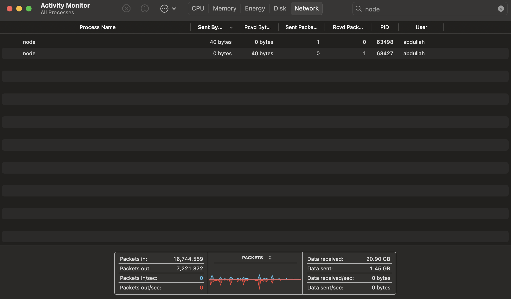
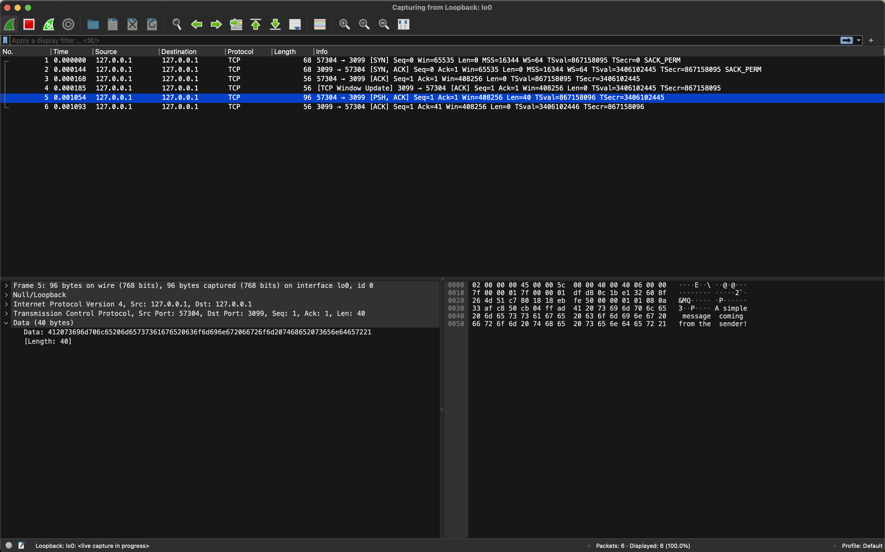
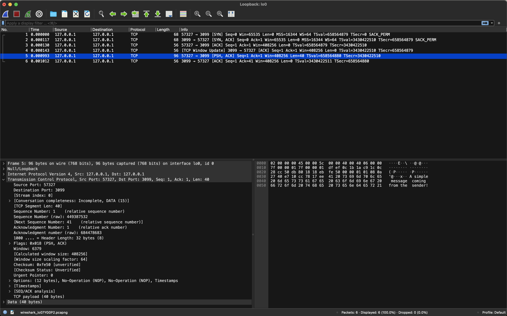
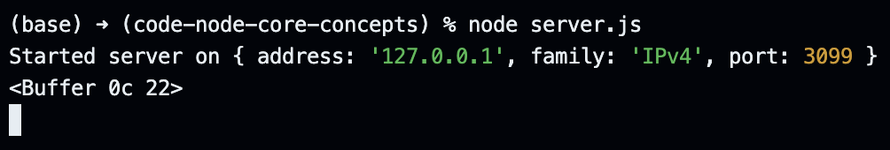

# Creating a Simple TCP Application in Node.

We can use the `net` module to create a TCP application in Node. The `net` module is v low-level and super powerful.

```javascript
const net = require("node:net");
```

The `createServer` method exposed by the `net` module allows us to create a new TCP server. The method accepts a callback function as an argument.

```javascript
const net = require("node:net");

const server = net.createServer((socket) => {});
```

Before we write some logic inside the callback function, we need to start listening to the requests sent to our server. For this, we invoke the `listen` method on our server, pass in a port, provide a loopback IP address, and specify the callback to execute once the server starts up.

```javascript
const net = require("node:net");

const server = net.createServer((socket) => {});

server.listen(3099, "127.0.0.1", () => {
  console.log("Started server on", server.address());
});
```

Executing `node server.js` in the terminal logs the following to the console.

<p align="center">
    
</p>

Now that we have our server running, any other application on our machine can send a TCP request to our loopback address on the specified port; if we deploy and replace our loopback address with the Public IP address, any other application in the world can send a TCP request to our server regardless of the programming language used.

Moving back to the callback function inside the `createServer` method, the socket argument provides information about each connection to our server - if a connection is established, the socket argument returns an object with details about the connection.

```javascript
const net = require("node:net");

const server = net.createServer((socket) => {
  socket.on("data", (data) => {
    console.log(data.toString("utf-8"));
  });
});

server.listen(3099, "127.0.0.1", () => {
  console.log("Started server on", server.address());
});
```

After making these changes, we restart our server, write the following logic in a new file called `sender.js`, and execute the file in a new terminal to send a message to our TCP server.

```javascript
const net = require("node:net");

const socket = net.createConnection({ host: "127.0.0.1", port: 3099 }, () => {
  socket.write("A simple message coming from the sender!");
});
```

Upon execution, we should get the following message in the terminal running our TCP server.

<p align="center">
    
</p>

If we open up the Activity Monitor and search for "node" on the Network Tab, we should have two processes, one sending some bytes and the other receiving them - each character in the message represents one byte.

<p align="center">
    
</p>

For more intricate analysis on each bit, we can open up Wireshark before executing `sender.js` and track the packets sent to the Loopback address. Wireshark shows multiple packets, but some of them are "SYN", others are "ACK", some are tracked on the receiving server, while others are tracked at the sending connection. However, only one packet with "PSH, ACK" has the "data" property containing the data we are sending.

<p align="center">
    
</p>

 Note that the size of our packet is greater than 40 bytes because Transport Layer, Network Layer, and Data Link Layer add their own headers before sending data over the network. Also, to explore the headers added to each packet, we can expand properties in the bottom-left console.

<p align="center">
    
</p>

We do not need to understand each of these headers as Software Engineers, but diving deep into these details can be rewarding for Network Engineers.

One final thing before we wrap up this lecture: `socket.write` is a write a stream, so we can send a message to the server, but we can also send a buffer to the server.

```javascript
const net = require("node:net");

const socket = net.createConnection({ host: "127.0.0.1", port: 3099 }, () => {
  const buff = Buffer.alloc(2);
  buff[0] = 12;
  buff[1] = 34;

  socket.write(buff);
});
```

To receive the buffer without enforcing UTF-8 character encoding on it, we log data to the console without any conversions.

```javascript
const net = require("node:net");

const server = net.createServer((socket) => {
  socket.on("data", (data) => {
    console.log(data);
  });
});

server.listen(3099, "127.0.0.1", () => {
  console.log("Started server on", server.address());
});
```

The terminal running the server should display the following when we execute the updated `sender.js`.

<p align="center">
    
</p>
