# The Transport Layer.

The Network Layer works with IP addresses. It gets a message, breaks it down into different packets, and moves it from Point A to Point B regardless of the distance between the source and the destination.

The role of the Network Layer is v simple, but a ton can go wrong. Some packets get retransmitted, causing duplication on the end machine, while other packets get lost during transmission. There is also the issue of Point B shutting down altogether during transmission due to power outage, for example.

The Network Layer provides us no way to handle these issues, and is precisely where the Transport Layer comes into the picture - it ensures reliable data transfer between end systems. In the Transport Layer, we have two main protocols to move data around: TCP and UDP.

TCP ensures that every single bit that we send is received by the destination node, and that no part is changed during the tranfer. For example, if we want to send a password for verification, we must ensure that every single bit of the password is received at the destination, otherwise the password can never be compared properly.

UDP does not care if every single bit that we send is received by the destination node, and there is no way to check the consistency of data when using UDP. Therefore, it used for services where sending every single bit is not important - e.g. video streaming, voice talking, face-timing, etc. When viewing a live transmission, we do not care about losing a frame or two and we do not want it to get retransmitted. Instead, we care about speed over consistency, which is why UDP is the protocol of choice for such applications.

    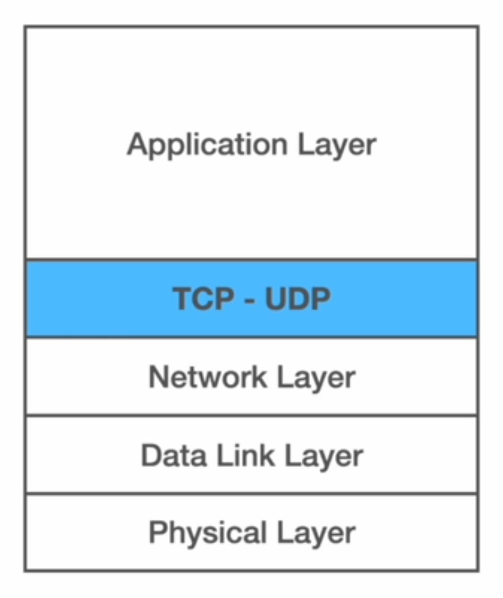

In Node, the `net` module is exclusively for building TCP applications. For UDP, we have another module called `dgram` module.

## TCP.

Suppose that we have two devices and we want to send some data from Device A to Device B.

    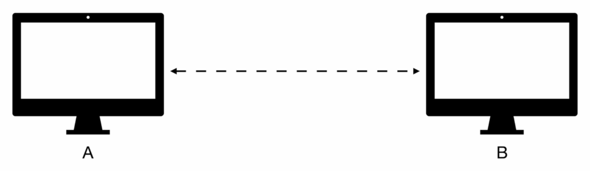

TCP works with a three-way handshake. First, it sends a TCP segment from Device A to Device B.

    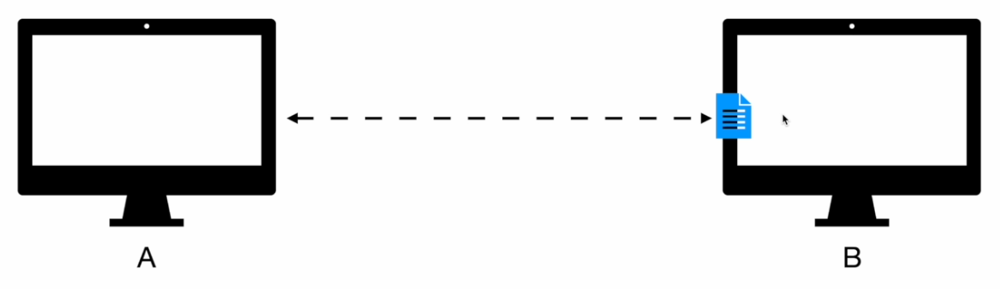

Then, Device B acknowleges receiving the TCP segment.

    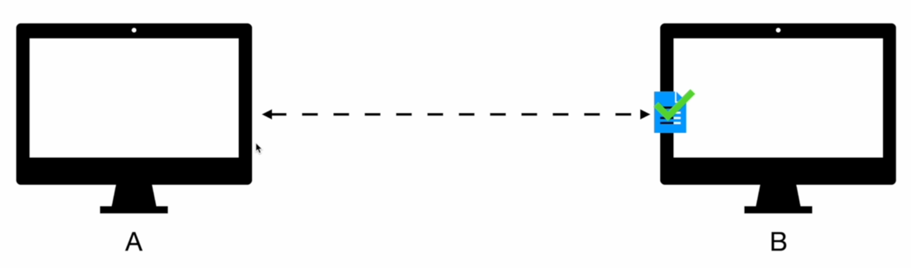

Third, it sends a request back to Device A to inform it about receiving the TCP segment and instructing it to send more TCP segments.

    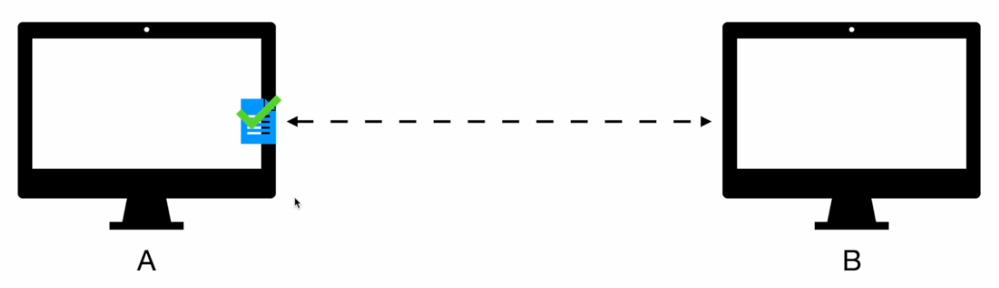

There are some headers in place that TCP uses to ensure that all the data is received correctly. The first header is called `Source Port`, which is the port that the request is getting sent from. For example, if we start a TCP server on port 8000 and then send a request from that TCP server, the "Source Port" header will have a value of "8000".

    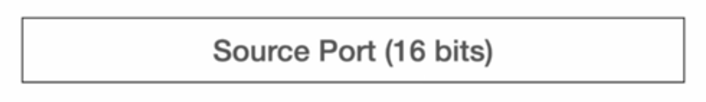

The second header is called `Destination Port`, which is the port that the request must be sent to.

    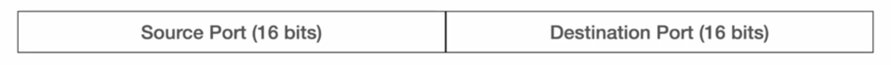

The third header is called `Sequence Number`, which allows the receiving end to re-assemble TCP segments in the order they were sent, and request that a TCP segment be re-transmitted if it did not arrive.

    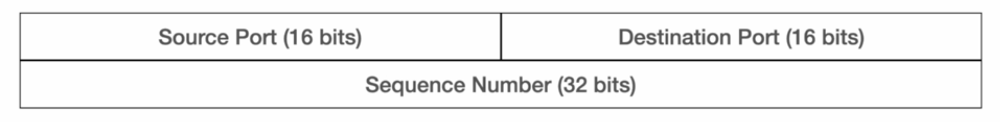

The fourth header is called `Acknowledgement Number`, which is used by a receiver to acknowledge receipt of a TCP segment and indicate the next expected byte from the sender.

    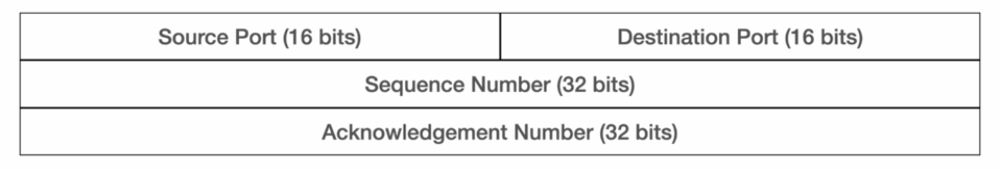

There are some other headers in each TCP segment that we do not need to know for this course. However, when time permits, reading about their purpose can be a valuable exercise.

    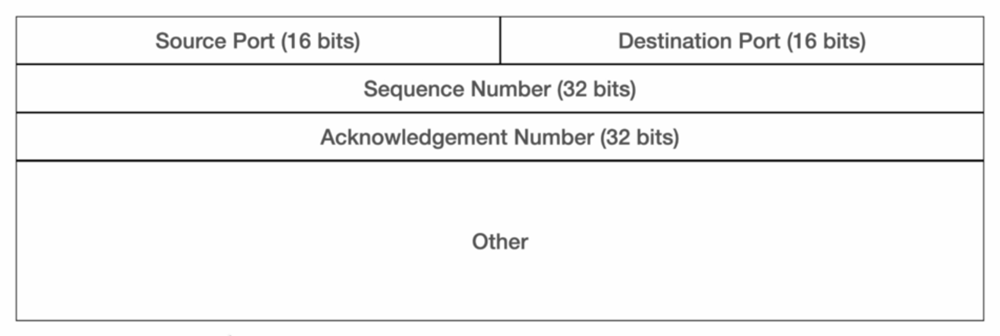

There is another important thing in a TCP segment beyond TCP headers, which is the optional `Data`. This part of the segment is used to hold the actual data that we want to send in a specific TCP segment.

    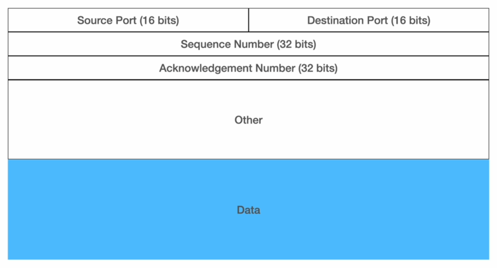

Note that we do not have IP addresses or the MAC addresses yet because the TCP segment needs to pass through the Network Layer and the Data Link Layer before transmission - each of them add their own headers.

## UDP.

UDP is a connectionless protocol and we not have a three-way handshake in UDP acknowledge receiving the UDP segment. However, each UDP segment also has some headers that we need to check out.

The first header is called `Source Port`, which is the port that the request is getting sent from.

    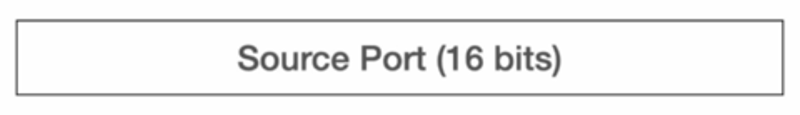

The second header is called `Destination Port`, which is the port that the request must be sent to.

    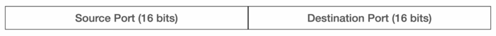

The third header is called `Segment Length`, which indicates how big the segment itself is. Since we are in the Transport Layer, this header does not account for the size of the IP address or the MAC address.

    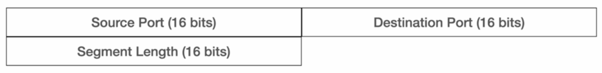

The fourth header is called `Checksum`, which is number computed using data. This computation happens twice, once at the source where the value is stored into the header, and then at the destination, where the stored value is compared to computed value to check if the data is corrupted or not.

    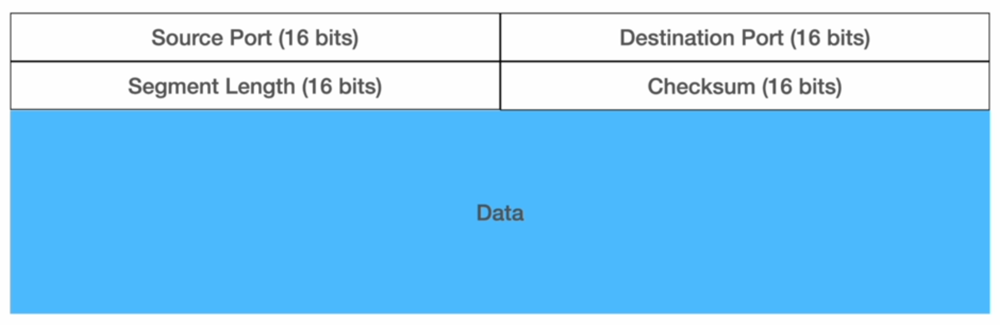

Note that the size of the TCP headers can vary, but the size of the UDP headers is fixed at 64 bits or 8 bytes.
